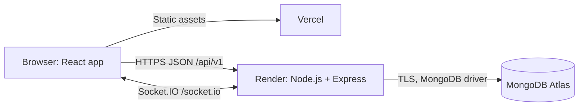

# System architecture

## Deployment topology

Vercel serves the client. The browser calls Render directly for HTTP and Socket.IO. A single Node.js HTTP server hosts Express and Socket.IO on the same port. MongoDB Atlas is the only durable store. Browser code never receives the database connection string.

## Server boundaries

- HTTP layer: authentication, rooms, initial note reads, history, restore, health.
- Socket layer: authenticated room subscriptions, note changes, presence, state resynchronization.
- Shared services: validate permissions and data, perform transactions, generate revisions, and publish committed changes.
- Data layer: users, sessions, rooms, memberships, notes, and immutable versions.
- In-memory state: connected sockets per user/room and a bounded per-room mutation queue. This state is disposable on restart.

## Write path

1. Validate session, membership, payload, limits, and operation ID.
2. Enter the per-room mutation queue used by both edits and restores.
3. Revalidate authorization and read the current revision.
4. In one MongoDB transaction, update the current note and insert its immutable version. A unique operation ID prevents a retry from creating another revision.
5. After commit, broadcast the canonical note and acknowledge the initiator.
6. Clients accept only newer revisions and independently retain any unsubmitted draft.

There is no saved acknowledgment before persistence. A crash after commit but before broadcast is recovered by retrying the same operation ID and fetching canonical state. Network delivery is not assumed to be exactly once.

## Read, join, and restore

HTTP reads and Socket.IO joins check membership. Serialize room subscription and initial snapshot capture with the room queue: register the socket before returning the snapshot; clients buffer incoming events until the snapshot is installed and apply only newer revisions. This closes the snapshot/subscription race.

History is paginated and immutable. Restore reads a version belonging to the same room and writes its content as a new current revision; it never rewinds the revision counter or deletes history. Restore requires the expected current revision so a stale confirmation fails with a conflict.

## Consistency and limits

Core conflict policy is full-document last-write-wins in server processing order, not client-clock order. A stale edit may be accepted and overwrite newer text. Acknowledged previous content remains in history. This policy converges but does not merge user intent.

Keep one backend replica. Multiple replicas or overlapping deployment processes can race; transaction write conflicts must retry against current database state, but cross-process presence and broadcasts are not supported. After deployment every client resynchronizes; a periodic 15-second state check repairs missed broadcasts even if a connection remains open. See [realtime protocol](realtime-protocol.md).

No local server file is durable application storage. Do not depend on Render disk for notes, sessions, or history.
